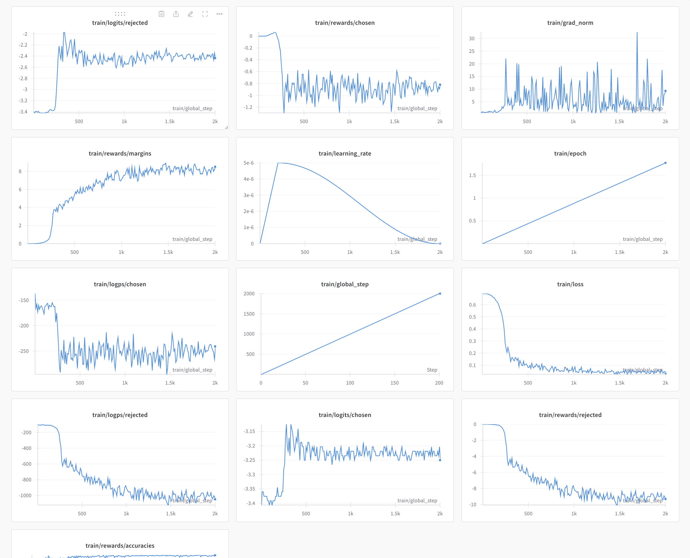
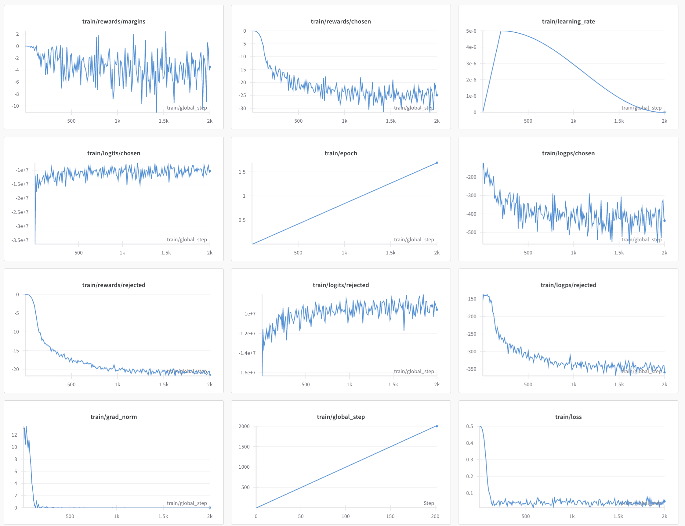

# preference_optimization

This repository demonstrates various algorithms for preference optimization, including Direct Preference Optimization (DPO), Kullback-Leibler-based Preference Optimization (KTO), and Simple Preference Optimization (SimPO) using TRL trainers.

## Experiment Overview

The experiment aims to compare the effectiveness and convergence of the three preference optimization algorithms:

- **DPO (Direct Preference Optimization)**
- **KTO (Kullback-Leibler-based Preference Optimization)**
- **SimPO (Simple Preference Optimization)**

The evaluation is based on the training loss and other performance metrics logged during the experiment.

## Reproducing the Experiment

Follow the steps below to reproduce the experiment:

### 1. Install Dependencies

Ensure all required libraries are installed by running:

```bash
bash setup.bash
```

### 2. Run the Experiment

To run the experiment, execute the `run_script.bash` file:

```bash
bash run_script.bash
```

Before running the script, ensure the following:

- Correct Accelerate Configuration: Verify that the correct configuration for accelerate is set up.
- Experiment Script Selection: Choose the appropriate Python script for the experiment:
    •   dpo.py for Direct Preference Optimization.
    •   kto.py for Kullback-Leibler-based Preference Optimization.
	•   simpo.py for Simple Preference Optimization.
- Experiment Configuration File: Confirm the corresponding yaml configuration file for the selected experiment is correctly set (e.g., trainig_configs/dpo_v1.yaml).

The script will execute the training process and automatically:
	1.	Merge the LoRA adapter with the base model.
	2.	Save the final model in the `models/` directory.

## Experiment Results

The following results were observed during the experiment:
•	DPO and KTO: Both algorithms demonstrated stable convergence.

### DPO


### KTO



•	SimPO: This algorithm did not converge within the experiment’s settings.
